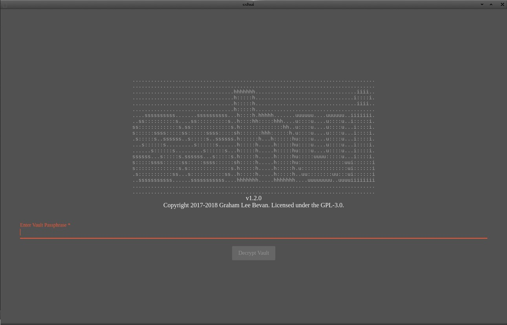
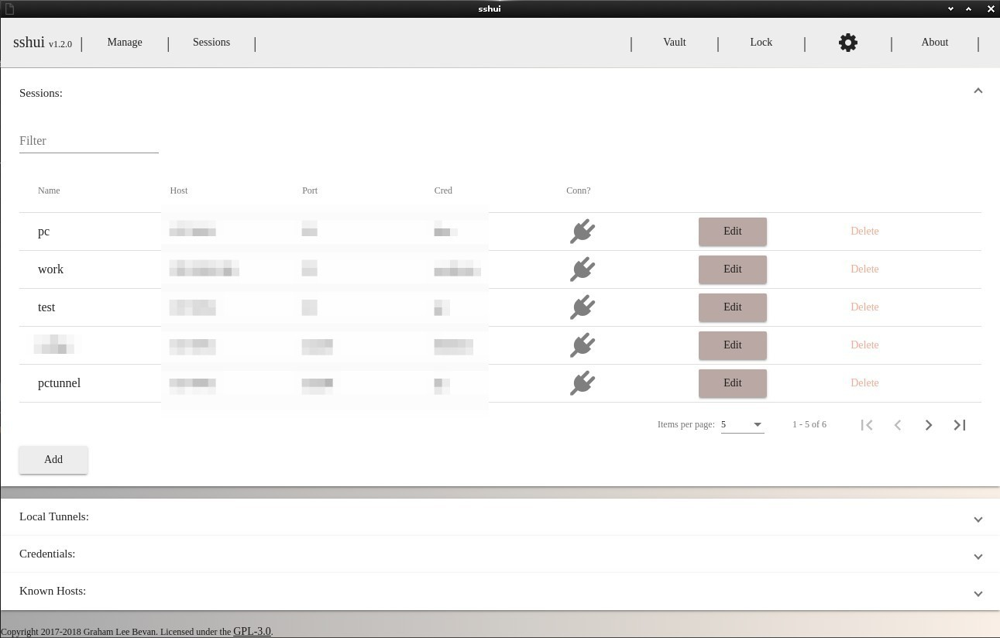
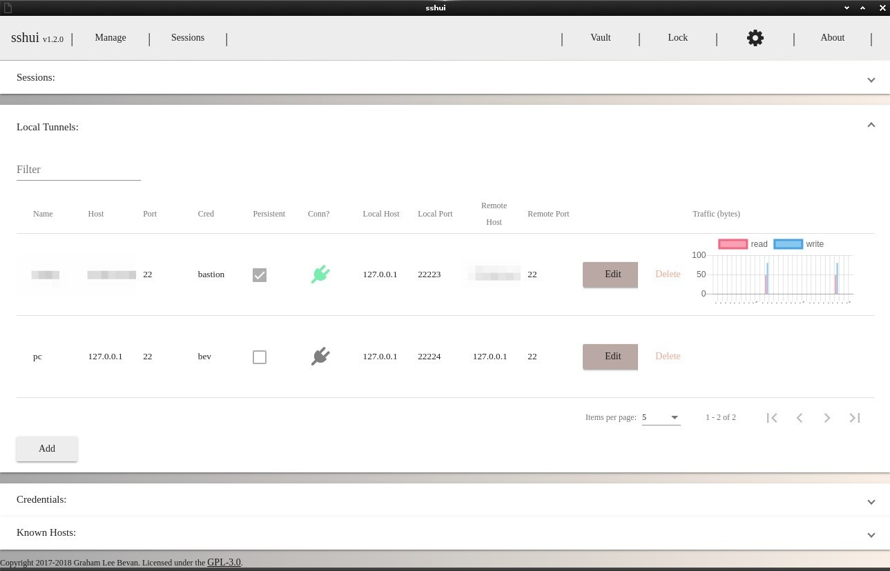
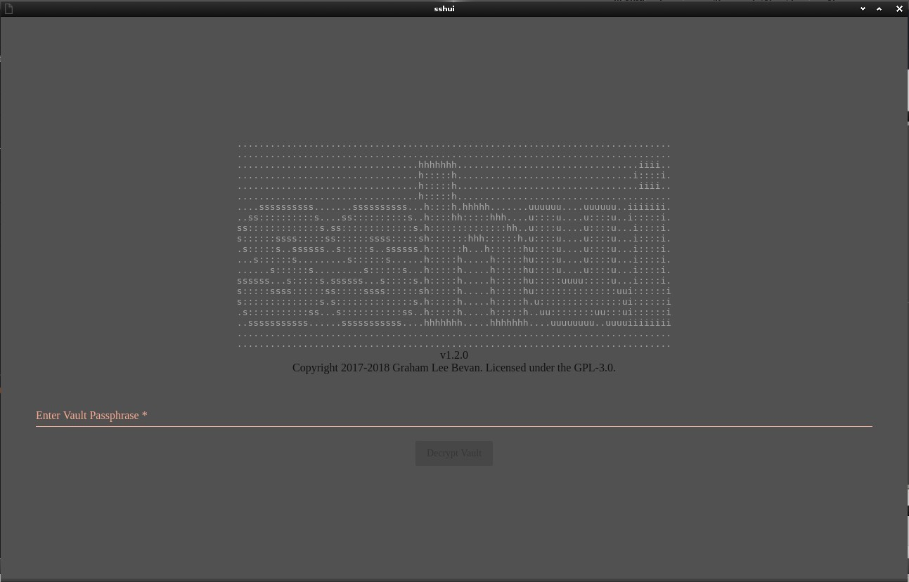

# sshui
|  |  |
|-|-|
<pre>
...............................................................................
...............................................................................
.................................hhhhhhh.................................iiii..
.................................h:::::h................................i::::i.
.................................h:::::h.................................iiii..
.................................h:::::h.......................................
....ssssssssss.......ssssssssss...h::::h.hhhhh.......uuuuuu....uuuuuu..iiiiiii.
..ss::::::::::s....ss::::::::::s..h::::hh:::::hhh....u::::u....u::::u..i:::::i.
ss:::::::::::::s.ss:::::::::::::s.h::::::::::::::hh..u::::u....u::::u...i::::i.
s::::::ssss:::::ss::::::ssss:::::sh:::::::hhh::::::h.u::::u....u::::u...i::::i.
.s:::::s..ssssss..s:::::s..ssssss.h::::::h...h::::::hu::::u....u::::u...i::::i.
...s::::::s.........s::::::s......h:::::h.....h:::::hu::::u....u::::u...i::::i.
......s::::::s.........s::::::s...h:::::h.....h:::::hu::::u....u::::u...i::::i.
ssssss...s:::::s.ssssss...s:::::s.h:::::h.....h:::::hu:::::uuuu:::::u...i::::i.
s:::::ssss::::::ss:::::ssss::::::sh:::::h.....h:::::hu:::::::::::::::uui::::::i
s::::::::::::::s.s::::::::::::::s.h:::::h.....h:::::h.u:::::::::::::::ui::::::i
.s:::::::::::ss...s:::::::::::ss..h:::::h.....h:::::h..uu::::::::uu:::ui::::::i
..sssssssssss......sssssssssss....hhhhhhh.....hhhhhhh....uuuuuuuu..uuuuiiiiiiii
...............................................................................
...............................................................................
</pre>
A desktop application to manage ssh credentials, sessions and persistent tunnels.

Built using nw.js, Angular and Angular Material.
The goal is to provide secure persistent SSH tunnels into private networks
like AWS VPCs via a Bastion host.  The tunnels can be set to auto restart
after suspend/resume of your workstation.

All credentials/keys are encrypted in a JSON AES256GCM vault using
[lowdb](https://github.com/typicode/lowdb).

SSH protocol support is provided by the npm project
[ssh2](https://github.com/mscdex/ssh2) which is a
pure javascript implementation of an SSH2 client.  Therefore this
app does not need to depend upon OpenSSH or Putty etc being installed - it
is completely self-contained.

Terminal support is provided by [xterm.js](https://github.com/xtermjs/xterm.js).
The `screen` command is leveraged for terminal persistent (multi-)sessions where
it is available on endpoints.

Please feel free to contribute.

## Downloads

Prebuilt zip packages for linux64, osx64 and win64 are available in
[Releases](https://github.com/gbevan/sshui/releases).

## Screenshots
### Login

### Sessions

### Local Tunnels

### Unlock


## COPYRIGHT

Copyright 2017-2018 Graham Lee Bevan <graham.bevan@ntlworld.com>

## LICENSE

[GPL-3.0](https://github.com/gbevan/sshui/blob/master/LICENSE)

## Developer Notes

### Start webpack in watch mode for continuous builds while developing
```bash
$ gulp webpack
```
to run a single webpack without watching for changes:
```bash
$ gulp webpackrel
```
### Run the app using nw.js direct from source (no build)
```bash
$ node_modules/nw/nwjs/nw --nwapp=.
```
with a temp vault and debugging enabled
```bash
$ rm /tmp/v; DEBUG="sshui:*" node_modules/nw/nwjs/nw --nwapp=. --db=/tmp/v
```
TODO: migrate this into gulp

v0.5: this is now achieved by simply running:
```bash
$ gulp run
```
### Run the protractor E2E UI test suite

(requires protractor installed globally)
```bash
$ DEBUG="sshui:*" protractor ./protractor-conf.js
```
TODO: migrate this into gulp

v0.5: (make sure webpack has been run, or `gulp` (in watch and webpack mode)):
```bash
$ gulp e2e
```
### Build package with SDK for debugging
```bash
$ gulp build
```
Creates the build in the (yep you guessed it) `build/` folder

### Run the built development package with debugging and a temp vault
```bash
$ rm /tmp/v; DEBUG="sshui:*" build/sshui/linux64/sshui --db=/tmp/v
```
the `--db=/tmp/v` tells sshui to use a different vault db file, for testing.

### Run the app in continuous source edit/webpack with watch modes
```bash
$ gulp
```

### To build the Release zip files
```bash
$ gulp release
```
Release packages will be in `'release/sshui - v?.?.?/'`, ready to upload to
github Releases.
